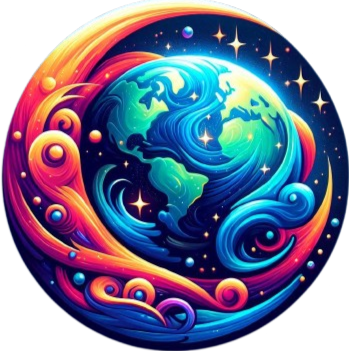

<p align="center">
  
</p>

# WorldCast 🌎📻📺

WorldCast brings the **world of radio, TV, and news** right to your fingertips — all for free. Explore live content from every corner of the globe with an intuitive, interactive interface.

---

## 🚀 Features

- **Listen to global radio stations** from thousands of channels.  
- **Watch live TV** from international sources.  
- **Read news from around the world** in one place.  
- **Interactive 3D globe** to explore content by country.  
- **No account needed**, completely free.

---

## 🌐 Sources

WorldCast aggregates content from trusted third-party sources:

- **Radio:** [Radio Browser API](https://fi1.api.radio-browser.info/)  
- **TV & IPTV:** [IPTV.org](https://github.com/iptv-org/iptv) and [TV-Garden](https://github.com/TVGarden/tv-garden-channel-list)  
- **News:** [GDELT Project](https://www.gdeltproject.org/)

---

## 🛠️ Built With

- **Next.js** – React framework for frontend & SSR  
- **React** – Core library for UI  
- **Three.js** – 3D globe visualization  
- **HLS.js** – Live streaming support  
- **Tailwind CSS / Custom CSS** – Styling and layout  

---

## 📬 Contact / Connect

Have feedback, questions, or want to say hi? You can reach me at:  

- **Email:** [borisgallegorios05@gmail.com](borisgallegorios05@gmail.com)  
- **GitHub:** [boris027](https://github.com/Boris027)  
- **LinkedIn:** [bgallegorios](https://www.linkedin.com/in/bgallegorios/)  

---

## 📥 Installation & Setup

1. Clone the repository:

```bash
git clone https://github.com/Boris027/WorldCast.git
```

2. Navigate to the project directory:
   
```bash
cd WorldCast
```

3. Install dependencies

```bash
npm install
```

4. Run the development server:

```bash
npm run dev
```

5. Open http://localhost:3000 in your browser to see WorldCast in action.

---

## ⚖️ Legal Disclaimer

WorldCast is a **free, personal project** created for educational and entertainment purposes. All radio, TV, and news content is provided by third-party sources. WorldCast does not host or own any content — it simply provides access to publicly available streams and information.

By using WorldCast, you acknowledge that all rights to the content belong to their respective owners. No commercial use or profit is intended.

